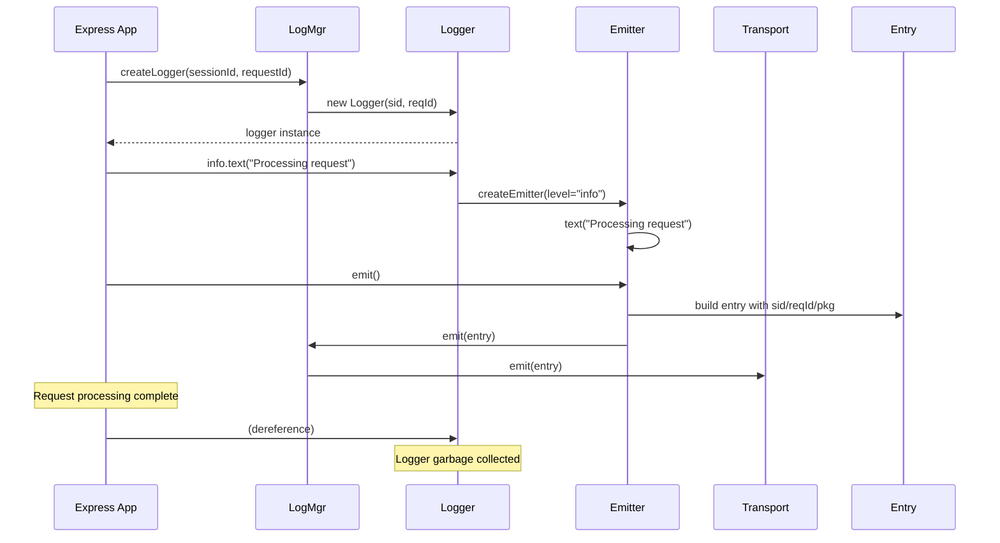

# Logger Architecture Specification

## Overview

This specification defines a hierarchical logging system designed for server applications (Express.js, etc.) with support for session tracking, request correlation, and module identification.

## Core Concepts

### Context Hierarchy
- **Session ID (sid)**: Identifies a user session (single value)
- **Request ID (reqId)**: Identifies a specific request within a session (single value)  
- **Package (pkg)**: Identifies the module/file generating the log (nestable path)

### Object Lifecycle
- **LogMgr**: Application-scoped, manages transports and creates loggers
- **Logger**: Request-scoped, carries sid/reqId context for request lifetime
- **Emitter**: Message-scoped, carries pkg context and builds individual log entries

## Architecture Diagrams

```mermaid
classDiagram
    class LogMgr {
        +threshold: LogLevel
        +transports: Transport[]
        +createLogger(sid?, reqId?) Logger
        +addTransport(transport) void
        +emit(entry) void
    }
    
    class Logger {
        +sid?: string
        +reqId?: string
        +mgr: LogMgr
        +createEmitter(pkg?) Emitter
        +info: LevelEmitter
        +error: LevelEmitter
        +debug: LevelEmitter
    }
    
    class LevelEmitter {
        +level: LogLevel
        +logger: Logger
        +text(msg) Emitter
        +value(key, val) Emitter
    }
    
    class Emitter {
        +logger: Logger
        +pkg?: string
        +level: LogLevel
        +message: MessageBuilder
        +data: Record<string, any>
        +emit() void
        +text(msg) Emitter
        +value(key, val) Emitter
    }
    
    class Entry {
        +timestamp: Date
        +level: LogLevel
        +sid?: string
        +reqId?: string
        +pkg?: string
        +msg: MessageBuilder
        +data?: Record<string, any>
    }
    
    class Transport {
        +setup() Promise<void>
        +emit(entry) void
        +stop() Promise<void>
    }
    
    LogMgr ||--o{ Transport : manages
    LogMgr ||--o{ Logger : creates
    Logger ||--o{ LevelEmitter : provides
    Logger ||--o{ Emitter : creates
    LevelEmitter ||--o{ Emitter : creates
    Emitter ||--|| Entry : builds
    Transport ||--o{ Entry : receives
```



```mermaid
graph TD
    A[Express Request] --> B[LogMgr.createLogger(sid, reqId)]
    B --> C[Logger Instance]
    C --> D[Module A calls logger.info.text()]
    C --> E[Module B calls logger.error.text()]
    D --> F[Emitter with pkg='moduleA']
    E --> G[Emitter with pkg='moduleB']
    F --> H[Entry: sid, reqId, pkg='moduleA']
    G --> I[Entry: sid, reqId, pkg='moduleB']
    H --> J[All Transports]
    I --> J
    J --> K[Console, File, Logdy, etc.]
    
    style C fill:#e1f5fe
    style H fill:#f3e5f5
    style I fill:#f3e5f5
```

## API Specification

### LogMgr Interface
```typescript
interface LogMgr<T extends MessageBuilder> {
  threshold: LogLevel;
  transports: Transport[];
  
  // Create logger with request context
  createLogger(sid?: string, reqId?: string): Logger<T>;
  
  // Transport management
  addTransport(transport: Transport): void;
  removeTransport(transport: Transport): void;
  
  // Internal emission
  emit(entry: Entry): void;
}
```

### Logger Interface
```typescript
interface Logger<T extends MessageBuilder> {
  readonly sid?: string;
  readonly reqId?: string;
  readonly mgr: LogMgr<T>;
  
  // Create emitter with package context
  createEmitter(pkg?: string): Emitter<T>;
  
  // Level-specific emitters
  readonly error: LevelEmitter<T>;
  readonly warn: LevelEmitter<T>;
  readonly info: LevelEmitter<T>;
  readonly debug: LevelEmitter<T>;
}
```

### Emitter Interface
```typescript
interface Emitter<T extends MessageBuilder> {
  readonly logger: Logger<T>;
  readonly pkg?: string;
  readonly level: LogLevel;
  
  // Message building
  text(message: string): this;
  value(key: string, value: any): this;
  
  // Emit the log entry
  emit(): void;
}
```

### Entry Interface
```typescript
interface Entry {
  timestamp: Date;
  level: LogLevel;
  sid?: string;      // Single session ID
  reqId?: string;    // Single request ID  
  pkg?: string;      // Nested package path (e.g., "api/users/controller")
  msg: MessageBuilder;
  data?: Record<string, any>;
}
```

## Usage Patterns

### Express.js Integration
```typescript
app.use((req, res, next) => {
  // Create request-scoped logger
  req.logger = logMgr.createLogger(
    req.session?.id,
    `req-${Date.now()}-${Math.random()}`
  );
  next();
});

app.get('/users/:id', (req, res) => {
  // All logs in this request carry the same sid/reqId
  req.logger.info.text('Fetching user').value('userId', req.params.id).emit();
  
  // Module-specific logging
  const userService = new UserService(req.logger);
  userService.getUser(req.params.id);
});

class UserService {
  constructor(private logger: Logger) {}
  
  getUser(id: string) {
    // Logs carry pkg context
    this.logger.createEmitter('services/user')
      .info.text('Database query').value('query', 'SELECT * FROM users').emit();
  }
}
```

### Package Nesting
```typescript
// In api/users/controller.ts
logger.createEmitter('api/users/controller').info.text('Processing request').emit();

// In api/users/service.ts  
logger.createEmitter('api/users/service').debug.text('Validating input').emit();

// In api/users/repository.ts
logger.createEmitter('api/users/repository').debug.text('Database query').emit();
```

## Implementation Changes Required

### 1. Update Entry Interface
- Change `reqIds: string[]` → `reqId?: string`
- Change `pkgs: string[]` → `pkg?: string`
- Keep `sid?: string` as single value

### 2. Logger Factory Pattern
- `LogMgr.createLogger(sid?, reqId?)` returns new Logger instance
- Logger carries context for its lifetime
- Logger creates Emitters with package context

### 3. Emitter Enhancement
- Add `pkg?: string` parameter to emitter creation
- Emitter builds Entry with logger's sid/reqId + its own pkg

### 4. Transport Updates
- Update all transports to handle single values instead of arrays
- Update Logdy transport to send flat structure with single fields

## Architecture Benefits

This architecture provides clean separation of concerns:
- **LogMgr**: Application-level configuration and transport management
- **Logger**: Request-level context (sid/reqId) 
- **Emitter**: Message-level context (pkg) and building
- **Entry**: Immutable log record with all context

The hierarchical context (session → request → package) maps naturally to server application patterns while maintaining flexibility for other use cases.

## Migration Path

1. **Phase 1**: Update Entry interface to use single values
2. **Phase 2**: Add createLogger() method to LogMgr
3. **Phase 3**: Update Logger to carry context and create Emitters
4. **Phase 4**: Update all transports to handle new Entry format
5. **Phase 5**: Update examples and documentation

This phased approach ensures backward compatibility during migration while enabling the new context-aware logging patterns.
