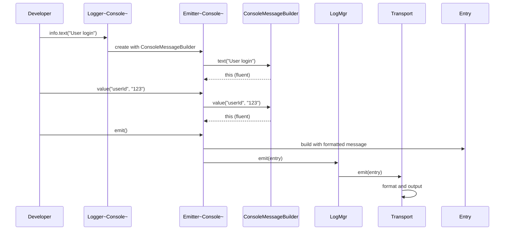

# Logger Architecture Specification

## Core Architecture Philosophy

The logger is built around **pluggable message building** as its central concept. The MessageBuilder abstraction allows different output formats (Console, JSON, XML, etc.) while maintaining a consistent logging API. Context tracking (sid/reqId/pkg) is a secondary feature that enhances the core message building system.

## Primary Components

### 1. MessageBuilder - The Core Abstraction
The MessageBuilder is the heart of the system, defining how log messages are constructed and formatted:

```typescript
interface MessageBuilder {
  // Core message construction
  text(message: string): this;
  value(key: string, value: any): this;
  
  // Formatting and output
  format(options?: FormatOptions): string;
  
  // Builder pattern methods
  clone(): this;
  reset(): this;
}
```

**Key insight**: Different MessageBuilder implementations (Console, JSON, Structured) determine the final output format, making the logger adaptable to any logging destination or format requirement.

### 2. LogMgr - Configuration and Orchestration
The LogMgr manages the overall logging configuration and coordinates between loggers and transports:

```typescript
interface LogMgr<T extends MessageBuilder> {
  // Core configuration
  threshold: LogLevel;
  loggerFactory: IFactoryMethods<T>;
  
  // Logger creation (enhanced for context)
  getLogger(): Logger<T>;
  createLogger(sid?: string, reqId?: string): Logger<T>;
  
  // Transport management
  addTransport(transport: Transport): void;
  emit(entry: Entry): void;
}
```

**Key insight**: The generic `<T extends MessageBuilder>` makes the entire system type-safe and ensures consistency between message building and transport handling.

### 3. Logger - Message Initiation
The Logger provides the developer-facing API and manages message lifecycle:

```typescript
interface Logger<T extends MessageBuilder> {
  // Context (secondary feature)
  readonly sid?: string;
  readonly reqId?: string;
  
  // Core logging interface
  readonly error: LevelEmitter<T>;
  readonly warn: LevelEmitter<T>;
  readonly info: LevelEmitter<T>;
  readonly debug: LevelEmitter<T>;
  
  // Enhanced emitter creation
  createEmitter(level: LogLevel, pkg?: string): Emitter<T>;
}
```

### 4. Emitter - Message Construction
The Emitter is where MessageBuilder integration happens:

```typescript
interface Emitter<T extends MessageBuilder> {
  // Core message building (delegates to MessageBuilder)
  text(message: string): this;
  value(key: string, value: any): this;
  
  // Context enhancement
  pkg(packagePath: string): this;
  
  // Finalization
  emit(): void;
  
  // Internal
  readonly messageBuilder: T;
  readonly logger: Logger<T>;
}
```

**Key insight**: The Emitter wraps the MessageBuilder, adding context and lifecycle management while preserving the builder pattern.

## Architecture Diagrams

```mermaid
classDiagram
    class MessageBuilder {
        <<interface>>
        +text(msg: string) this
        +value(key: string, val: any) this
        +format(options?) string
        +clone() this
        +reset() this
    }
    
    class ConsoleMessageBuilder {
        +text(msg: string) this
        +value(key: string, val: any) this
        +format() string
        +h1(text: string) this
        +color(color: string) this
    }
    
    class JSONMessageBuilder {
        +text(msg: string) this
        +value(key: string, val: any) this
        +format() string
        +nested(key: string) this
    }
    
    class LogMgr~T~ {
        +threshold: LogLevel
        +loggerFactory: IFactoryMethods~T~
        +getLogger() Logger~T~
        +createLogger(sid?, reqId?) Logger~T~
        +addTransport(transport) void
        +emit(entry) void
    }
    
    class Logger~T~ {
        +sid?: string
        +reqId?: string
        +mgr: LogMgr~T~
        +error: LevelEmitter~T~
        +info: LevelEmitter~T~
        +createEmitter(level, pkg?) Emitter~T~
    }
    
    class Emitter~T~ {
        +messageBuilder: T
        +logger: Logger~T~
        +pkg?: string
        +text(msg) this
        +value(key, val) this
        +emit() void
    }
    
    class Entry {
        +timestamp: Date
        +level: LogLevel
        +sid?: string
        +reqId?: string
        +pkg?: string
        +msg: MessageBuilder
        +data?: Record~string, any~
    }
    
    MessageBuilder <|-- ConsoleMessageBuilder
    MessageBuilder <|-- JSONMessageBuilder
    LogMgr ||--o{ Logger : creates
    Logger ||--o{ Emitter : creates
    Emitter ||--|| MessageBuilder : wraps
    Emitter ||--|| Entry : builds
```



## Core Design Principles

### 1. MessageBuilder Polymorphism
Different MessageBuilder implementations enable different output formats without changing the logging API:

```typescript
// Console output with colors and formatting
const consoleMgr = new LogMgr<ConsoleMessageBuilder>();
consoleMgr.loggerFactory = Console.factoryMethods;

// JSON output for structured logging
const jsonMgr = new LogMgr<JSONMessageBuilder>();
jsonMgr.loggerFactory = JSON.factoryMethods;

// Same API, different output
logger.info.text("User action").value("userId", 123).emit();
```

### 2. Type Safety Through Generics
The `<T extends MessageBuilder>` constraint ensures compile-time compatibility:

```typescript
// This ensures Transport can handle the MessageBuilder type
class Transport<T extends MessageBuilder> {
  constructor(private mgr: LogMgr<T>) {}
  
  emit(entry: Entry<T>): void {
    // entry.msg is guaranteed to be type T
    const formatted = entry.msg.format();
  }
}
```

### 3. Builder Pattern Consistency
All components use fluent interfaces for ease of use:

```typescript
logger.error
  .text("Database connection failed")
  .value("host", "db.example.com")
  .value("timeout", 5000)
  .emit();
```

## Context Enhancement (Secondary Feature)

The context system (sid/reqId/pkg) enhances the core MessageBuilder system for server applications:

### Single-Value Context Fields
```typescript
interface Entry {
  // Core message
  msg: MessageBuilder;
  level: LogLevel;
  timestamp: Date;
  
  // Context enhancement
  sid?: string;      // Session ID (single value)
  reqId?: string;    // Request ID (single value)  
  pkg?: string;      // Package path (nestable: "api/users/service")
  data?: Record<string, any>;
}
```

### Request-Scoped Loggers
```typescript
// Express.js middleware
app.use((req, res, next) => {
  req.logger = logMgr.createLogger(
    req.session?.id,
    `req-${Date.now()}`
  );
  next();
});

// All logs in request carry same sid/reqId
req.logger.info.text("Processing request").emit();
```

## Implementation Analysis

### Current Issues
1. **Array-based context**: `reqIds: string[]` and `pkgs: string[]` don't match the single-value use case
2. **Missing factory method**: No `createLogger()` for request-scoped loggers
3. **Package context**: No way to specify module/file context per log message

### Proposed Changes

#### Phase 1: Entry Interface Update
```typescript
// Before
interface Entry {
  reqIds?: string[];  // ❌ Array doesn't match use case
  pkgs?: string[];    // ❌ Array doesn't match use case
  sid?: string;       // ✅ Already correct
}

// After  
interface Entry {
  reqId?: string;     // ✅ Single request ID
  pkg?: string;       // ✅ Single package path
  sid?: string;       // ✅ Unchanged
}
```

#### Phase 2: Logger Factory Enhancement
```typescript
class LogMgr<T extends MessageBuilder> {
  // Enhanced factory method
  createLogger(sid?: string, reqId?: string): Logger<T> {
    return new Logger(this, sid, reqId);
  }
}
```

#### Phase 3: Package Context in Emitters
```typescript
class Logger<T extends MessageBuilder> {
  createEmitter(level: LogLevel, pkg?: string): Emitter<T> {
    return new Emitter(this, level, pkg);
  }
}
```

## Architecture Strengths

1. **MessageBuilder Abstraction**: Enables any output format while maintaining consistent API
2. **Type Safety**: Generic constraints ensure compile-time compatibility
3. **Pluggable Transports**: Clean separation between message building and output
4. **Fluent Interface**: Developer-friendly builder pattern throughout
5. **Context Layering**: Clean separation of application (LogMgr), request (Logger), and message (Emitter) concerns

## Conclusion

The logger's strength lies in its **MessageBuilder-centric architecture** that enables format flexibility while maintaining type safety. The context enhancement (sid/reqId/pkg) is a valuable addition for server applications but should not overshadow the core message building abstraction that makes the system truly powerful and reusable.

The proposed changes maintain this architectural integrity while adding the context features needed for modern server application logging.
