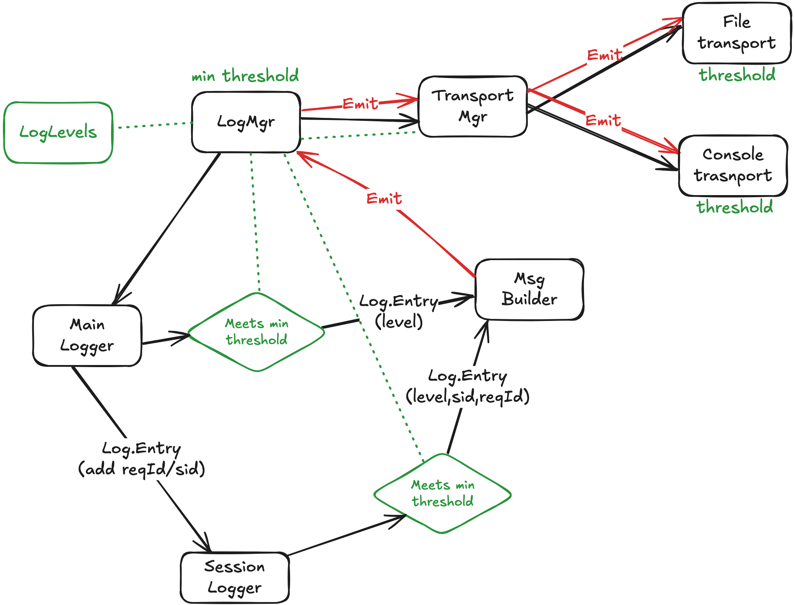

# Classes

The `@epdoc/logger` library is built around two core concepts: the [LogMgr](#log-manager-logmgr) (Log Manager) and [Logger](#loggers) instances.

### Hierarchy



## Log Manager (`LogMgr`)

The `LogMgr` is the central component responsible for managing the entire logging setup. It's typically a singleton in your application. Its main responsibilities include:

-   **Configuration:** Setting the global log level `threshold` and controlling what metadata is displayed (e.g., timestamps, request IDs) via the `show` property.
-   **Transports:** Managing where your logs are sent (e.g., console, file).
-   **Logger Factory:** Creating and providing `Logger` instances.
-   **Emitter Management:** Creating specialized `Emitter` instances that handle the direct communication between message builders and transports.

### Creating a `LogMgr`

You can create a new `LogMgr` instance as follows:

```typescript
import { Log } from '@epdoc/logger';

const logMgr = new Log.Mgr();
```

### Selecting the [Logger](#loggers) Type

`@epdoc/logger` supports two types of loggers out of the box, each with its own set of log levels:

-   **`std` (Default):** Standard log levels (`error`, `warn`, `info`, `verbose`, `debug`, `trace`, `spam`).
-   **`cli`:** Log levels suited for command-line applications (`error`, `warn`, `help`, `data`, `info`, `debug`, `prompt`, `verbose`, `input`, `silly`).

You select the logger type when you configure your `LogMgr`. To use the `cli` logger, you must provide the `cli.createLogLevels` function to the `LogMgr` constructor and set the `loggerFactory` to `cli.getLogger`.

```typescript
import { Log } from '@epdoc/logger';

// Configure LogMgr to use the CLI logger and its log levels
const logMgr = new Log.Mgr(Log.cli.createLogLevels);
logMgr.loggerFactory = Log.cli.createLogger;

const logger = logMgr.getLogger<Log.cli.Logger<Log.MsgBuilder.Console>>(); // This will be a CliLogger instance
```

If you don't provide these, the `LogMgr` defaults to the `std` logger.

### Important `LogMgr` Methods

-   `set threshold(level: Level.Name | Level.Value)`: Sets the minimum log level to be processed.
-   `set show(opts: EmitterShowOpts)`: Controls what information (e.g., `level`, `timestamp`) is included in the log output.
-   `addTransport(transport: Transport.Base<M>)`: Adds a transport (e.g., `FileTransport`).
-   `start()` / `stop()`: Starts and stops the `LogMgr` and its transports.

## Loggers

A `Logger` is the object you interact with directly to write log messages. You can get a logger from a [LogMgr](#log-manager-logmgr) instance.

### Root and Child Loggers

-   **Root Logger:** Your primary, application-wide logger, obtained by calling `logMgr.getLogger()`.
-   **Child Logger:** A logger created from another logger (a root or another child). It inherits its parent's configuration but can have unique properties, which is especially useful for tracing specific operations like handling a web request.

```typescript
// Get a root logger
const rootLogger = logMgr.getLogger<Log.std.Logger<Log.MsgBuilder.Console>>();

// Create a child logger for a specific request
const childLogger = rootLogger.getChild({ reqId: 'xyz-123' });

// Use the child logger to log messages related to this request
childLogger.info('Processing request...');
```

### Logging a Message

To log a message, you access a property on the logger that corresponds to a log level (e.g., `log.info`, `log.debug`). This returns a `MsgBuilder` object that you can use to construct and then emit your message. The `MsgBuilder` provides a chainable interface.

#### New Streamlined Architecture

The logging architecture has been significantly improved with the introduction of the `Emitter` class. When you call `log.info`, the following happens:

1. **Logger Method Call:** `log.info` calls `LogMgr.getMsgBuilder('info', this)`
2. **Emitter Creation:** LogMgr creates a specialized `Emitter` instance that:
   - Captures the logger's context (level, sid, reqIds, pkgs)
   - Holds a direct reference to the `TransportMgr`
   - Contains threshold information for both emit and flush operations
3. **MsgBuilder Factory:** LogMgr uses the configured factory to create the appropriate MsgBuilder type
4. **Direct Emit Path:** When you call `.emit()`, the MsgBuilder calls the Emitter directly, which then calls the TransportMgr

This creates a much simpler and more efficient emit flow:
- **Before:** `MsgBuilder.emit()` → `Logger.emit()` → `LogMgr.emit()` → `TransportMgr.emit()` → `Transport.emit()`
- **After:** `MsgBuilder.emit()` → `Emitter.emit()` → `TransportMgr.emit()` → `Transport.emit()`

```typescript
// Simplest example of writing a log message to the console
import { Log } from '@epdoc/logger';

let logMgr = new Log.Mgr().setThreshold('debug');
let log = logMgr.getLogger();         // defaults to returning the std logger

log.info.h1('Hello, world!').emit();

// A more complex example
log.info
  .h1('This is a header')
  .label('label').value('value')
  .emit();
```

### Conditional Logging

The `MsgBuilder` also supports conditional logging, which allows you to build and emit log messages only when certain conditions are met. This is useful for reducing logging verbosity and focusing on specific scenarios.

The conditional logging methods are:

-   `if(condition: boolean)`: Starts a conditional block. The following methods will only be executed if the `condition` is `true`.
-   `elif(condition: boolean)`: Starts an "else if" block. The following methods will only be executed if the previous `if` or `elif` conditions were `false` and this `condition` is `true`.
-   `else()`: Starts an "else" block. The following methods will only beexecuted if all previous `if` and `elif` conditions were `false`.
-   `endif()`: Ends a conditional block.

Here's an example of how to use conditional logging:

```typescript
const someCondition = true;
const anotherCondition = false;

log.info
  .if(someCondition)
    .text('This will be logged because someCondition is true.')
  .elif(anotherCondition)
    .text('This will NOT be logged.')
  .else()
    .text('This will NOT be logged either.')
  .endif()
  .emit();
```

### Performance Timing

Loggers provide built-in performance timing capabilities through the `mark()` and `demark()` methods, along with the message builder's `ewt()` (Emit With Time) method.

#### Creating Performance Marks

Use `mark()` to create a performance mark that records the current timestamp:

```typescript
const log = logMgr.getLogger();
const mark = log.mark(); // Returns a unique mark identifier (e.g., "mark.1")
```

#### Measuring Elapsed Time

Use `demark()` to measure elapsed time since a mark was created:

```typescript
const mark = log.mark();
// ... perform some operation ...
const elapsed = log.demark(mark); // Returns elapsed time in milliseconds
console.log(`Operation took ${elapsed}ms`);
```

The `demark()` method accepts an optional `keep` parameter:
- `keep: false` (default): Removes the mark after measurement
- `keep: true`: Preserves the mark for future measurements

```typescript
const mark = log.mark();
// ... first operation ...
const elapsed1 = log.demark(mark, true); // Keep the mark
// ... second operation ...
const elapsed2 = log.demark(mark); // Total elapsed time, mark is removed
```

#### Emit With Time (`ewt()`)

The `ewt()` method combines timing measurement with log emission, automatically formatting and including the elapsed time in the log output:

```typescript
const log = logMgr.getLogger();

// Basic usage
const mark = log.mark();
// ... perform operation ...
log.info.h1('Operation completed').ewt(mark);
// Output: "Operation completed (123 ms)"

// With keep parameter
const processMark = log.mark();
// ... step 1 ...
log.debug.h1('Step 1 done').ewt(processMark, true);
// ... step 2 ...
log.info.h1('Process completed').ewt(processMark);
```

#### Time Formatting

Elapsed times are automatically formatted with appropriate precision:
- **> 100ms**: No decimal places (e.g., "123 ms")
- **10-100ms**: 1 decimal place (e.g., "45.6 ms")
- **1-10ms**: 2 decimal places (e.g., "7.89 ms")
- **< 1ms**: 3 decimal places (e.g., "0.123 ms")

#### Example: Measuring Database Operations

```typescript
import { Log } from '@epdoc/logger';

const logMgr = new Log.Mgr().init();
const log = logMgr.getLogger();

async function processUser(userId: string) {
  const queryMark = log.mark();
  const user = await database.findUser(userId);
  log.debug.h1('User query').value(userId).ewt(queryMark);
  
  const updateMark = log.mark();
  await database.updateUser(user);
  log.info.h1('User updated').value(userId).ewt(updateMark);
}
```

### Using the Message Builder Standalone

You can also use a `MsgBuilder` (like `ConsoleMsgBuilder`) on its own, without a `Logger` or `LogMgr`, for general-purpose string formatting with styling. 

When you instantiate a builder without any arguments, the `emit()` method outputs to the console, but you can still use all the formatting and styling methods. To get the final string, call the `format()` method.

Refer to our [MsgBuilder documentation](./MSGBUILDER.md) for more concrete examples.


## Transports

Transports allow directing output to the console, to a file, to a database, or to a remote server. If none are specified then the default is to log to the console.

```typescript
// Add a file transport
const fileTranport = new Log.FileTransport({ filename: 'my.log' });
logMgr.addTransport(fileTranport);

log.info.h1('This will be written to the console and to').path('my.log').emit();
```

There is more on [transports here](./transports.md).