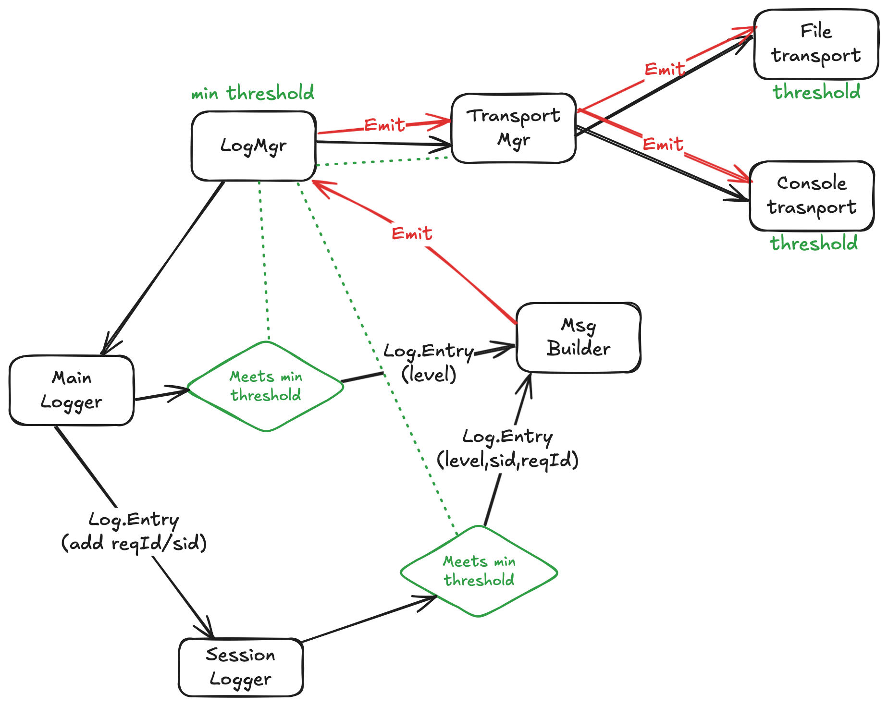

## Getting Started

There are two main objects you will use when logging messages:

- [LogManager](#logmanager-class)
  - Usually a singleton
  - Contains a Transport Manager (see {@link LogManager#transports}) that
    - manages the transports (setup and teardown)
    - buffers log messages until the transports are turned on
    - writes to emitted messages to all transports
  - Called to get a new Logger object
- [Logger](#logger-class) object
  - Can use just one logger object for all your logging needs
  - Can create a new logger object for every module, or for every request (e.g. express request), or every major
    operation (usually just for requests).
  - Provides chainable methods by which to write log output

```typescript
// Simplest example of writing a log message to the console

import { Log } from '@epdoc/logger';

let logMgr = new Log.Mgr().setThreshold('debug');
let log = logMgr.getLogger();

log.info.h1('Hello, world!').emit();
```

Thresholds are set at the LogManager level, but can also be overridden at the transport level.

Transports allow directing output to the console, to a file, to a database, or to a remote server. If none are specified
then the default is to log to the console.

```typescript
// Add a file transport to the previous example

const fileTranport = new Log.FileTransport({ filename: 'my.log' });
logMgr.addTransport(fileTranport);

log.info.h1('This will be written to the console and to').path('my.log').emit();
```

Calls to log.info, log.debug, etc. return a [MsgBuilder](./src/msg-builder.ts) object that can be used to build a log
message. The MsgBuilder object is chainable and can be used to build a message in parts.

```typescript
log.info
  .h1('This is a header')
  .label('label').value('value')
  .emit();
```

When writing to the console, the above example will output in color.

You can also control whether the log level and a timestamp are displayed on a log line.

```typescript
logMgr.show({ level: true, timestamp: 'elapsed' });
```

What is displayed is set at the LogManager level, but can also be overridden at the transport level.

And, if you are working within express or some other backend framework, you can set the session ID and the request ID
and have these output as well.

```typescript
req.log = log.getChild({ sid: req.sessionID, reqId: req.id });
log.info.text('Request received').emit();
```

### Hierarchy



### LogMgr Class

A shortcut for getting a [LogMgr](../src/logmgr.ts) singleton is to call the module's `getLogManager` method.

```typescript
import { LogManager } from '@epdoc/logger';

let logMgr = new LogManager();
```

An alternative is to manage your own {@link LogManager} object:

```typescript
let epdocLogger = require('epdoc-logger');
let LogManager = epdocLogger.LogManager;
let logMgr = new LogManager();
```

Because you may need to load config information before configuring your transport you must explicitly start logging by
calling {@link LogManager#start}. And, because some log tranports are buffered, you should also call {@link
LogManager#flushing} or {@link LogManager#destroying} before shutting down.

### Logger Class

{@link Logger} objects are created by calling {@link LogManager#getLogger} or `new Logger()`. Typically you would create
a new Logger object for every javascript file and set a unique _emitter_ name for that Logger. Alternatively, when
responding to requests, for example when using [Express](http://expressjs.com), it is a better idea to tie the emitter
to the request. This is described later in this document.

Loggers are created by calling [getLogger](./src/log-manager.ts#L188).

```typescript
let log = logMgr.getLogger('emitter-name');

// This is equivalent
let log = new Logger(logMgr, 'emitter-name');

// A shortcut that is also equivalent and that uses a global LogManager object
let log = require('epdoc-logger').getLogger('emitter-name');
```

### MsgBuilder Class

### Other Classes

- [LogLevels](./log-levels.md)
- [LoggerTransport](./transports.md)
